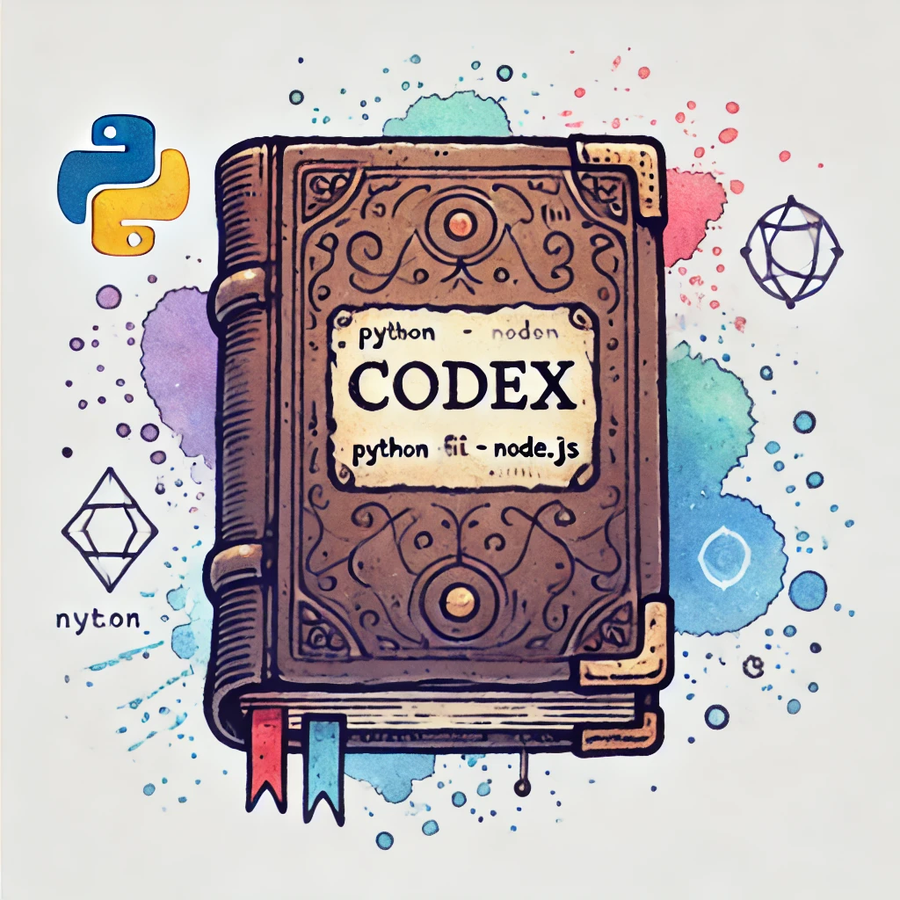

<div align="center">

# 📚 Codex

  

</div>

## 🔭 Overview

**Codex** is a centralized repository that serves as the core hub of documentation generation, automation, and AI integration across multiple projects and pipelines. Inspired by ancient codices—volumes of knowledge meticulously compiled and preserved—Codex is designed to be the modern evolution of a knowledge base, bringing together essential documentation, automation patterns, and AI-driven workflows in one organized platform.

Just as ancient codices preserved humanity's knowledge through generations, our Codex aims to preserve and evolve development knowledge through AI-powered automation and standardization.

## 📋 Table of Contents
- [🔭 Overview](#-overview)
- [🌟 Introduction](#-introduction)
- [🎯 Features](#-features)
- [📖 Technical Documentation](#-technical-documentation)
- [🚀 Installation](#-installation)
- [💡 Use Cases](#-use-cases)
- [🤝 Contributing](#-contributing)

## 🌟 Introduction

Codex is more than just a documentation library; it is a **strategic knowledge repository** that simplifies automation, optimizes workflows, and unifies documentation solutions in a single, accessible hub. With Codex, you can manage everything from documentation pipelines to AI integrations, all within a centralized framework that supports complex project environments.

### ✨ Key Highlights:
- **🏛️ Centralized Hub**: Generate, store, organize, and access documentation, configurations, and automation scripts in one place.
- **🤖 AI Integration**: Leverages AI (like Claude, GPT) within pipelines to execute stored functions, making documentation generation and workflow execution more dynamic and automated.
- **🔄 Versatility**: Compatible with various languages, frameworks, and pipelines, making it a universal tool for documentation across different projects.

## 🎯 Features

- **📚 Unified Repository**: Centralizes documentation management, providing easy access to reusable components.
- **⚡ Automated Pipelines**: Integrates automation scripts that can be triggered or adapted for specific documentation workflows.
- **🤖 AI Execution**: Executes functions stored within the Codex using AI, allowing for dynamic documentation generation.
- **🌐 Multi-Language Support**: Supports Python, JavaScript, TypeScript, and other popular languages for comprehensive documentation.
- **📈 Scalability**: Designed to scale with growing codebases and evolving documentation requirements.

## 📖 Technical Documentation

For detailed technical documentation:
- **📦 [Packages Documentation](pkg/README.md)**: Documentation for reusable packages and automation modules
- **🛠️ [Utilities Documentation](utils/README.md)**: Documentation for common utilities and helper functions

## 🚀 Installation

To install Codex, use the following steps:

1. Clone the repository:
    ```bash
    git clone https://github.com/your-org/codex.git
    ```
2. Navigate to the Codex directory:
    ```bash
    cd codex
    ```

## 💡 Use Cases

Codex can be used across various documentation scenarios:
- **🔄 Documentation Pipeline Automation**: Automate documentation generation, review, and deployment pipelines using Codex's intelligent workflow integrations.
- **📚 Centralized Documentation Management**: Generate, store, and manage documentation in one place.
- **🤖 AI-Driven Documentation**: Leverage Codex's ability to run AI-enhanced functions (using tools like Claude, GPT) as part of your documentation automation pipelines.
- **📈 Knowledge Evolution**: Continuously improve documentation through AI analysis and suggestions.

## 🤝 Contributing

We welcome contributions to Codex! To contribute:
1. Fork the repository.
2. Create a new branch for your feature or bug fix.
3. Commit your changes with clear messages.
4. Submit a pull request to the main branch.

---

Made with ❤️ by Akad - Frontend Team
